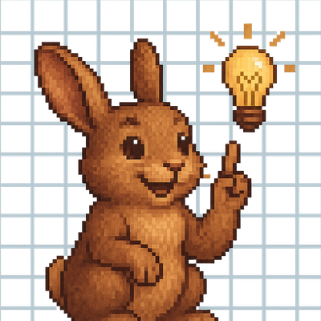

# GridPonder



A lightweight puzzle game platform built around a data-driven engine and a declarative DSL. Creators define games as structured data and assets — no custom code required. The engine interprets and runs any conforming game pack.

**[gridponder.org](https://gridponder.org/)** — play in the browser or download the app

## Game packs

Six complete games, 115+ levels:

| Pack | Levels | Mechanic |
|------|--------|----------|
| Carrot Quest | 19 | Avatar navigation, pushing, ice, portals |
| Number Crunch | 20 | Slide-and-merge with goal sequences |
| Rotate & Flip | 10 | 2×2 cursor rotate/flip to match a target pattern |
| Diagonal Swipes | 20 | 2×2 diagonal swaps with sum/count constraints |
| Flood Colors | 30 | Classic flood-fill under a move limit |
| Box Builder | 16 | Side-aware box fragment assembly |

Base tile sprites and character sprites live in `packs/gridponder-base/` and `packs/rabbit-character/` and are shared across packs.

## Repository structure

```
app/           Flutter app (iOS, Android, macOS, web) — the player-facing shell
engines/
  dart/        Pure-Dart engine package — used by the app
  python/      Python engine port — used by the solver and benchmark tools
packs/         Game packs defined in the GridPonder DSL
docs/
  dsl/         Full DSL specification (7 documents, version tracked in docs/dsl/VERSION)
  games/       Per-game design docs — mechanics, aha moments, level design guidance
tools/
  solver/      A* / BFS solver + generic engine adapter for any pack
  benchmark/   LLM agent benchmark runner
  tile-gen/    Pixel-art tile generation (SDXL-Turbo, MPS)
.claude/       Claude Code skills for game and level authoring
```

## Documentation

- [`docs/gridponder_platform_overview.md`](docs/gridponder_platform_overview.md) — architecture and design principles
- [`docs/dsl/`](docs/dsl/) — full DSL specification (layers, entities, systems, rules, goals, theme)
- [`docs/games/`](docs/games/) — design docs for each game pack

## Creator tooling

Four Claude Code skills are available for game authoring:

- `/create-game` — scaffold a new game pack from a design brief
- `/revise-level` — analyse and redesign a level using the solver
- `/test-level` — run a level's gold path with screenshots
- `/tile-gen` — generate pixel-art tiles using local AI (SDXL-Turbo, MPS)

After any change to engine logic, run `python engines/python/test_gold_paths.py` to verify all 115+ gold paths still pass across both engines.
